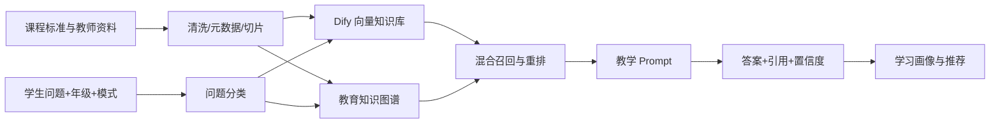

# 如意智学答辩与项目设计

## 一句话定位

把静态教材和教师自编资料变成“会追问、会溯源、会诊断”的个性化辅导老师。

## 10–15 分钟答辩节奏

1. **1 分钟：痛点**——普通大模型会幻觉，搜索答案不理解学生薄弱点，教师难以观察每个学生。
2. **2 分钟：产品**——学生端启发辅导、引用溯源、知识图谱、学情驾驶舱。
3. **3 分钟：架构**——文档清洗切片 → Dify 混合检索 → 图谱扩展 → 教学 Prompt → 引用与安全校验。
4. **4 分钟：现场演示**——问方程题；点击引用；切换知识图谱；展示掌握度变化；再问超范围问题展示拒答。
5. **2 分钟：实验结果**——展示自动化测试、检索命中、引用完整率、降级能力。
6. **1 分钟：分工与迭代**——数据、RAG、前后端、测试/答辩四条工作流。

## 技术架构

## 建议实验表

准备 30 道覆盖数学/物理、同义改写、超范围和安全问题的测试集，对比：

| 方案 | Recall@3 | 引用完整率 | 超范围拒答率 | 平均响应时间 |
|---|---:|---:|---:|---:|
| 纯 LLM | 待测 | 待测 | 待测 | 待测 |
| 基础 Dify RAG | 待测 | 待测 | 待测 | 待测 |
| Dify + 图谱扩展 | 待测 | 待测 | 待测 | 待测 |

不要编造实验数据；答辩前运行测试并填入真实结果。

## 团队分工模板

- 组长/产品：需求、里程碑、答辩串联。
- 数据与知识工程：资料版权核验、切片、元数据、知识图谱。
- RAG 与评测：Dify 工作流、检索参数、Prompt、测试集和消融实验。
- 前后端与展示：学生端、画像看板、接口、部署和演示录像。

每人保留 Git 提交、实验记录和个人答辩页，保证 15% 团队协作分可证明。
